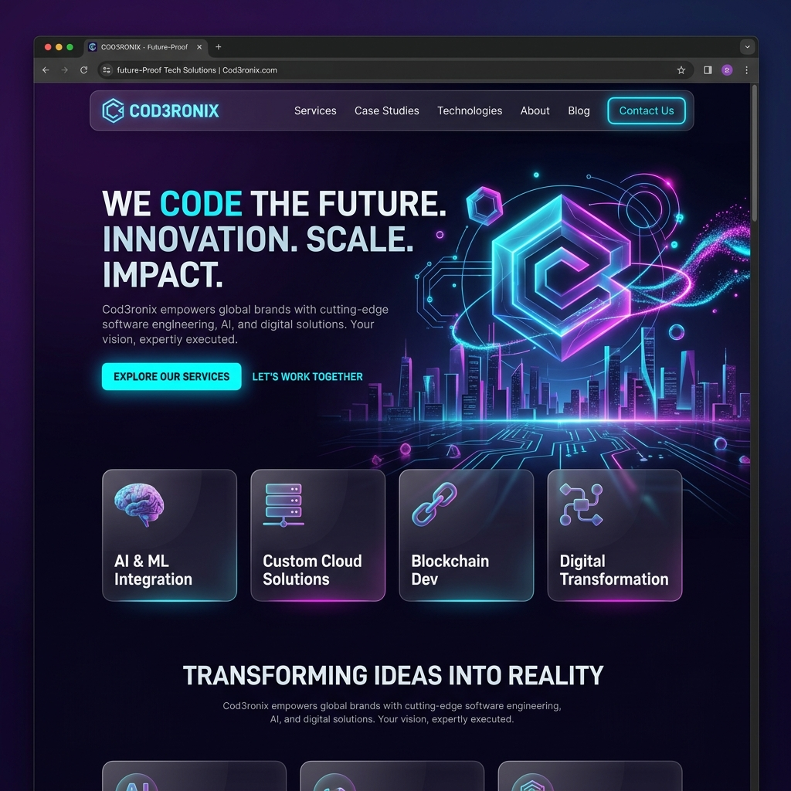

# Cod3ronix - Soluções Digitais 🚀



Cod3ronix é uma plataforma moderna e disruptiva dedicada a fornecer soluções digitais de alta performance. De produtos digitais a consultorias técnicas, ajudamos marcas a decolarem no mundo digital com tecnologia de ponta e design impecável.

## 🛠 Tecnologias

- **Frontend**: React 19, TypeScript, Vite, TailwindCSS
- **Animações**: Motion (Framer Motion)
- **Backend**: Node.js, Express, TypeScript
- **Segurança**: Helmet, Express-Rate-Limit, CORS
- **E-mail**: EmailJS (Client-side)
- **Ícones**: Lucide React

## 🚀 Funcionalidades

- **Design Premium**: Interface dark mode com estética futurista e responsiva.
- **Formulário de Contato Inteligente**: Integrado ao EmailJS para recebimento direto.
- **Lead de Orçamento**: Modal interativo para captação de projetos.
- **Segurança de Produção**: Configurado com cabeçalhos de segurança e limites de requisição.

## 📦 Como Rodar Localmente

### Pré-requisitos
- Node.js (v18+)
- NPM ou Yarn

### Instalação

1. Clone o repositório:
   ```bash
   git clone https://github.com/Gildeanderson/cod3ronix.git
   ```

2. Instale as dependências:
   ```bash
   npm install
   ```

3. Configure o arquivo `.env`:
   Crie um arquivo `.env` na raiz do projeto com as seguintes chaves:
   ```env
   VITE_EMAILJS_SERVICE_ID="seu_service_id"
   VITE_EMAILJS_TEMPLATE_ID="seu_template_id"
   VITE_EMAILJS_PUBLIC_KEY="sua_public_key"
   ```

4. Inicie o projeto:
   ```bash
   npm start
   ```

---

Desenvolvido com ❤️ por [Cod3ronix](https://github.com/Gildeanderson/cod3ronix)
